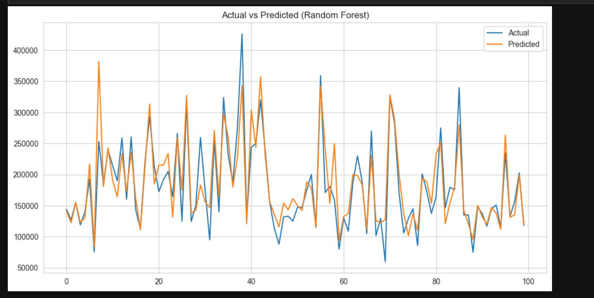

# 🏡 Predicting House Prices using Machine Learning

This project applies machine learning techniques to predict house prices based on various property features. It demonstrates full-stack data science skills — from data preprocessing and visualization to model training and evaluation.

## 🚀 Project Goals

- Understand the relationship between house features and their prices.
- Apply regression algorithms (Linear Regression, Random Forest).
- Evaluate and compare model performance using RMSE and R².
- Visualize results clearly for easy interpretation.

## 🛠️ Tools & Technologies Used

- Python 🐍
- Pandas 🧮
- NumPy 🔢
- Scikit-learn 🤖
- Matplotlib 📊
- Seaborn 🎨
- Jupyter Notebook 📓
- VS Code 🖥️

## 📊 Dataset

The dataset includes housing features such as:

- Number of bedrooms and bathrooms
- Living area square footage
- Location or zip code
- House condition or grade
- Target: `price`

> 📌 Data is loaded from `train.csv` or similar structured dataset.

## 📈 Machine Learning Models Used

- **Linear Regression** – as a baseline.
- **Random Forest Regressor** – for better performance on complex relationships.

## 🧪 Model Evaluation Metrics

- **RMSE** (Root Mean Squared Error)
- **R² Score** (Coefficient of Determination)

Example Output:
Linear Regression RMSE: 34347.54080552936
Linear Regression R²: 0.8431676357182913

Random Forest RMSE: 29075.27491318434
Random Forest R²: 0.8876192172184835


## 🧩 Key Visualizations

- Heatmap of feature correlation
- Actual vs Predicted price plot
- Feature importance (Random Forest)

## 📷 Final Output Screenshot

> 📸 *Below is a sample screenshot of the final result visualizations in Jupyter Notebook:*




## 🧑‍💻 How to Run the Project

1. Clone the repository:
   ```bash
   git clone https://github.com/yourusername/Predicting-House-Prices.git
   cd Predicting-House-Prices
   pip install -r requirements.txt
   jupyter notebook


